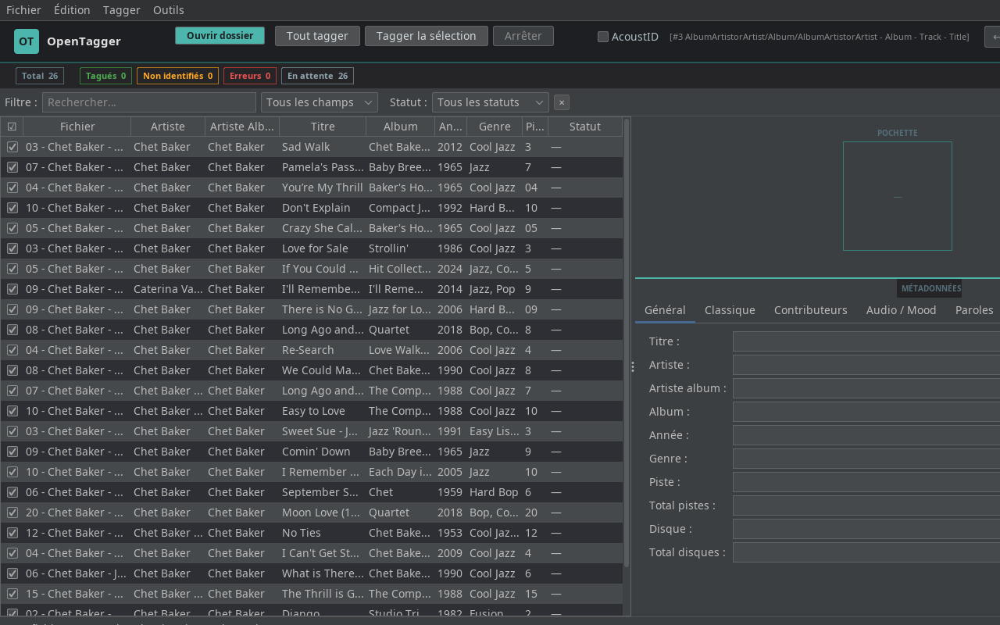

# OpenTagger

Tagger audio automatique open-source — alternative libre à Jaikoz.

Identifie et complète les métadonnées de vos fichiers MP3, FLAC, M4A, OGG via une chaîne de reconnaissance audio : **AcoustID → SongRec (Shazam) → AudD**, enrichie par **MusicBrainz**, **Discogs** et **Last.fm**.



---

## Fonctionnalités

### Identification audio

- **AcoustID** — empreinte audio (fpcalc) → MusicBrainz (MBID, artiste, album, piste, compilation)
- **SongRec** — client Shazam open-source, multi-offset (début / 1/3 / 2/3 du fichier), fallback si AcoustID échoue
- **AudD** — second fallback, retourne aussi l'ISRC Spotify
- **Discogs + Last.fm** — enrichissement des genres après identification
- **BPM** — détection automatique via ffmpeg
- **Essentia** — clé musicale, mode, danceability (si installé)
- **Paroles** — téléchargement automatique
- **FanArt TV** — pochettes haute résolution

#### Niveaux de confiance des sources

| Source | Fiabilité | Ancre Album Completion |
|--------|-----------|------------------------|
| MBID (déjà tagué) | ★★★★★ 100 % | ✓ |
| AcoustID | ★★★★☆ 90 % | ✓ |
| SongRec (Shazam) | ★★★☆☆ 85 % | ✓ |
| Texte seul | ★★☆☆☆ ~60 % | ✗ |

### Organisation de la bibliothèque

- **Renommage par masques** — 5 masques prédéfinis :
  - `[iTunes Smart]` — compilations dans `Compilations/`, sinon `AlbumArtist/Album/Track`
  - `Standard` — `AlbumArtist/Album/Track - Title`
  - `[Lidarr/Plex]` — `AlbumArtist/Album (Année)/Track - Title` (natif Lidarr)
  - `Fichier seul` — renomme sans déplacer
  - `[Podcast]` — `Podcasts/Show/Season 02/S02E14 Titre`
- **Aperçu live** des 4 masques avant d'appliquer (Ctrl+R)
- **Dossier racine bibliothèque** — tous les fichiers organisés vers un chemin configurable
- **Compatibilité NAS / MergerFS** — copie+vérification de taille avant suppression de la source (pas d'`ATOMIC_MOVE` cross-device)

### Podcasts *(nouveau en v0.9.0)*

Taguage et organisation automatique des fichiers podcast via flux RSS.

1. **Outils → Tagger comme podcast…**
2. Taper le nom du podcast → recherche iTunes (sans clé API) → sélection
3. Ou coller directement une URL RSS
4. Matching automatique fichier ↔ épisode **par durée audio** (ffprobe ± 5 s)
5. Dialog coloré : vert = matché, orange = non matché (à gérer manuellement)
6. Tags écrits : show, titre épisode, artiste, numéro, saison, date, URL flux RSS

Tags podcast écrits (compatibles iTunes / Plex / Jellyfin) :

| Champ | Tag ID3 | Tag MP4 |
|-------|---------|---------|
| URL flux RSS | `TXXX:PODCAST_URL` | `----:com.apple.iTunes:PODCAST_URL` |
| Saison | `TXXX:SEASON` | `----:com.apple.iTunes:SEASON` |
| Épisode | `TXXX:EPISODE` | `----:com.apple.iTunes:EPISODE` |
| Type | `TXXX:EPISODETYPE` | `----:com.apple.iTunes:EPISODETYPE` |
| Mots-clés | `TXXX:KEYWORDS` | `----:com.apple.iTunes:KEYWORDS` |

### Gestion des fichiers

- **Undo/Redo illimité** (Ctrl+Z / Ctrl+Y)
- **Détection de doublons** — 3 niveaux de confiance (MBID exact, AcoustID exact, heuristique titre+artiste). Sélection intelligente du meilleur fichier par qualité (FLAC > ALAC > M4A > OGG > MP3) puis taille.
- **Album Completion** — complète les fichiers SKIPPED d'un album en se basant sur les fichiers déjà identifiés par source fiable (pas SOURCE_TEXT)
- **Suppression des fichiers illisibles/corrompus**
- **Export CSV**, export/import historique JSON
- **Drag & drop** de dossiers et fichiers
- **Surveillance de dossier** (FolderWatcher) — rechargement automatique si fichiers ajoutés

### Intégration système

- **Clic droit → Ouvrir avec OpenTagger** (Linux `.desktop` + Windows registre)
- **Dossiers de démarrage automatiques** configurables (ignorés si fichiers passés en argument)
- **Windows** — compatible : configDir dans `%APPDATA%\OpenTagger\`, SongRec gracefully skippé, `where` au lieu de `which`

### Interface

- Layout **table à gauche / détail à droite** avec pochette 140×140
- **Barre de stats live** : Total / Tagués / Non identifiés / Erreurs
- **Filtre par statut** : isoler les fichiers non identifiés, en erreur, en attente
- Thème dark FlatLaf, accent teal
- **Journal de correction** généré après chaque session

### Contribution

- Soumission d'empreintes **AcoustID**
- Contribution à **MusicBrainz** via OAuth2
- Correspondance manuelle avec recherche MusicBrainz

---

## Pipeline d'identification

```
Fichier audio chargé
        │
        ▼
  Tags existants ?
  MBID présent ? ──► SOURCE_MBID (score 100) ──► TAGGED ✓
        │ non
        ▼
  AcoustID (fpcalc)
        │ ──► MusicBrainz ──► SOURCE_ACOUSTID (score 85-95)
        │ échec
        ▼
  SongRec / Shazam (multi-offset)
        │ ──► titre+artiste ──► SOURCE_SONGREC (score 85)
        │ échec
        ▼
  AudD (fallback)
        │ ──► SOURCE_AUDD (score 70-80)
        │ échec
        ▼
  SKIPPED ──► Album Completion (si album voisin identifié par source fiable)
```

---

## Installation

### Prérequis

- **Java 21+**
- **ffmpeg** (BPM, extraction segment audio pour SongRec)
- **fpcalc** (Chromaprint) — téléchargeable via **Préférences → Audio** si absent
- **SongRec** (optionnel, Linux/macOS) — `sudo apt install songrec` ou [github.com/marin-m/SongRec](https://github.com/marin-m/SongRec)

### Linux

```bash
git clone https://github.com/pollomax847/opentagger
cd opentagger
chmod +x install.sh && ./install.sh
```

Installe le `.desktop`, l'icône et crée un lanceur dans `~/.local/bin/opentagger`.

### Windows

```bat
install-windows.bat
```

Installe le JAR dans `%APPDATA%\OpenTagger\` et enregistre l'entrée "Ouvrir avec OpenTagger" dans le registre (clic droit sur fichier ET dossier).

### Lancement manuel

```bash
java -jar opentagger/target/opentagger.jar
# ou avec un fichier/dossier en argument (clic droit)
java -jar opentagger.jar /chemin/vers/musique
```

### Compiler depuis les sources

```bash
cd opentagger
mvn package -DskipTests
# JAR produit : target/opentagger.jar
```

---

## Configuration

Au premier lancement, **Préférences** (Ctrl+,) :

| Onglet | Paramètre | Obtenir la clé |
|--------|-----------|----------------|
| APIs | Clé AcoustID | [acoustid.org/login](https://acoustid.org/login) |
| APIs | Token AudD | [audd.io](https://audd.io) — 100 req/mois gratuit |
| APIs | Clé Discogs | [discogs.com/settings/developers](https://www.discogs.com/settings/developers) |
| APIs | Clé Last.fm | [last.fm/api](https://www.last.fm/api/account/create) |
| APIs | Clé FanArt TV | [fanart.tv/get-an-api-key](https://fanart.tv/get-an-api-key/) |
| Audio | Chemin fpcalc | Ou cliquer **Télécharger fpcalc** |
| Renommage | Dossier racine bibliothèque | Ex. `/nas/Musique` |
| Renommage | Dossier racine podcasts | Ex. `/nas/Podcasts` |

---

## Utilisation rapide

### Musique

1. **Ouvrir un dossier** (Ctrl+O ou drag & drop)
2. Cocher **AcoustID** si les fichiers sont peu tagués
3. **Tout tagger** (F5) ou **Tagger la sélection** (F6)
4. Filtre **⚠ Non identifiés** → lancer **Passe complète** (Ctrl+P) pour compléter l'album
5. **Ctrl+R** → aperçu renommage → appliquer

### Podcasts

1. Télécharger les épisodes dans un dossier
2. **Ouvrir ce dossier** dans OpenTagger
3. **Outils → Tagger comme podcast…**
4. Taper le nom ou coller l'URL RSS → sélectionner le podcast
5. Vérifier le tableau de matching (vert / orange) → **Tagger**

### Doublons

1. Charger la bibliothèque
2. **Outils → Détecter les doublons…**
3. Cliquer **Sélection intelligente** → les fichiers de moindre qualité sont cochés automatiquement
4. **Déplacer dans la corbeille**

---

## Technologies

| Composant | Technologie |
|-----------|-------------|
| Langage | Java 21 |
| Build | Maven + Shade plugin (fat JAR) |
| UI | Swing + FlatLaf 3.4 (thème dark) |
| Tags audio | JAudioTagger 3.0.1 + AtomicParsley + ffmpeg |
| JSON | Jackson |
| Cache | SQLite (Xerial) |
| Identification | AcoustID, SongRec (Shazam), AudD |
| Métadonnées | MusicBrainz, Discogs, Last.fm, FanArt TV |
| Podcasts | iTunes Search API + RSS (javax.xml) |

---

## Licence

MIT — libre d'utilisation, de modification et de distribution.
