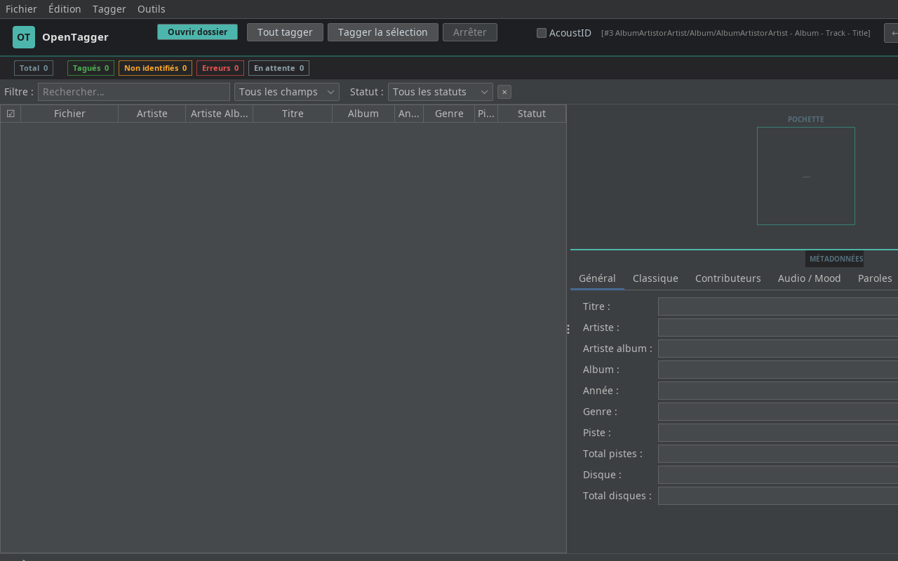
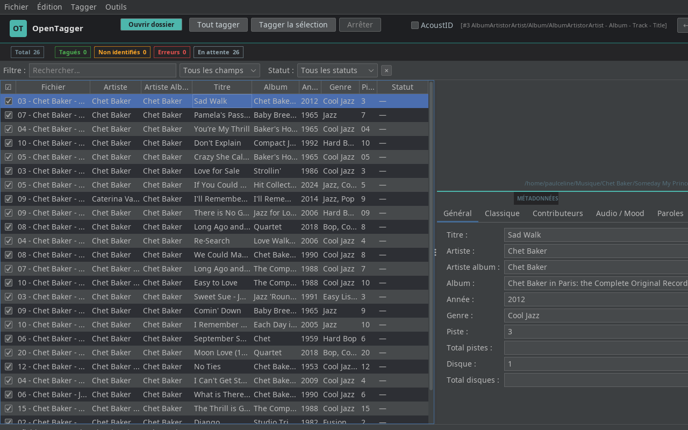

# OpenTagger

Tagger audio automatique open-source — alternative libre à Jaikoz.

Identifie et complète les métadonnées de vos fichiers MP3, FLAC, M4A, OGG via une chaîne de reconnaissance audio : **AcoustID → Shazam → AudD**, enrichie par **MusicBrainz**, **Discogs** et **Last.fm**.


---

## Fonctionnalités

### Identification audio
- **AcoustID** — empreinte audio (fpcalc) → MusicBrainz (MBID, artiste, album, piste)
- **Shazam** — via RapidAPI (fallback si AcoustID échoue)
- **AudD** — second fallback, retourne aussi l'ISRC Spotify
- **Discogs + Last.fm** — enrichissement des genres après identification
- **BPM** — détection automatique via ffmpeg
- **Essentia** — clé musicale, mode, danceability (si installé)
- **Paroles** — téléchargement automatique
- **FanArt TV** — pochettes haute résolution

### Interface
- Layout **table à gauche / détail à droite** avec pochette 140×140
- Header avec branding, **barre de stats live** (Total / Tagués / Non identifiés / Erreurs)
- **Filtre par statut** : isoler les fichiers non identifiés, en erreur, en attente
- **Sélection par statut** : Édition → Sélectionner les non identifiés
- **Aperçu avant renommage** : voir les nouveaux noms avant d'appliquer (Ctrl+R)
- Thème dark FlatLaf, accent teal

### Gestion des fichiers
- Undo/Redo illimité (Ctrl+Z / Ctrl+Y)
- Renommage par masques (35 masques configurables)
- Détection de doublons (par MBID, AcoustID ou heuristique titre/artiste)
- Suppression des fichiers illisibles/corrompus
- Export CSV, export/import historique JSON
- Drag & drop de dossiers

### Contribution
- Soumission d'empreintes **AcoustID**
- Contribution à **MusicBrainz** via OAuth2
- Correspondance manuelle avec recherche MusicBrainz

---

## Captures d'écran

### Interface vide au démarrage


### Fichier sélectionné — panneau de métadonnées


---

## Installation

### Prérequis
- Java 21+
- ffmpeg (pour BPM et identification Shazam/AudD)
- fpcalc (Chromaprint) — téléchargeable via **Préférences → Audio** si absent

### Linux
```bash
git clone https://github.com/pollomax847/opentagger
cd opentagger
chmod +x install.sh && ./install.sh
```

Le script installe le `.desktop`, l'icône et crée un lanceur dans `~/.local/bin/opentagger`.

### Lancement manuel
```bash
java -jar opentagger/target/opentagger.jar
```

### Compiler depuis les sources
```bash
cd opentagger
mvn package -DskipTests
```

---

## Configuration

Au premier lancement, allez dans **Préférences** (Ctrl+,) :

| Onglet | Paramètre | Obtenir la clé |
|--------|-----------|----------------|
| APIs | Clé AcoustID | [acoustid.org/login](https://acoustid.org/login) |
| APIs | Clé RapidAPI (Shazam) | [rapidapi.com](https://rapidapi.com/apidojo/api/shazam) — plan gratuit 500 req/mois |
| APIs | Token AudD | [audd.io](https://audd.io) — 100 req/mois gratuit |
| APIs | Clé Discogs | [discogs.com/settings/developers](https://www.discogs.com/settings/developers) |
| APIs | Clé Last.fm | [last.fm/api](https://www.last.fm/api/account/create) |
| APIs | Clé FanArt TV | [fanart.tv/get-an-api-key](https://fanart.tv/get-an-api-key/) |
| Audio | Chemin fpcalc | Ou cliquer **Télécharger fpcalc** |

---

## Utilisation rapide

1. **Ouvrir un dossier** (Ctrl+O ou drag & drop)
2. Cocher **AcoustID** si les fichiers sont peu tagués
3. Cliquer **Tout tagger** (F5) ou **Tagger la sélection** (F6)
4. Après identification, utiliser le filtre **⚠ Non identifiés** pour voir les fichiers manqués
5. **Ctrl+R** → aperçu du renommage avant d'appliquer

---

## Technologies

| Composant | Technologie |
|-----------|-------------|
| Langage | Java 21 |
| Build | Maven |
| UI | Swing + FlatLaf 3.4 (thème dark) |
| Tags audio | JAudioTagger 3.0.1 |
| JSON | Jackson |
| Cache | SQLite (Xerial) |
| Identification | AcoustID, Shazam, AudD |
| Métadonnées | MusicBrainz, Discogs, Last.fm, FanArt TV |

---

## Licence

MIT — libre d'utilisation, de modification et de distribution.
