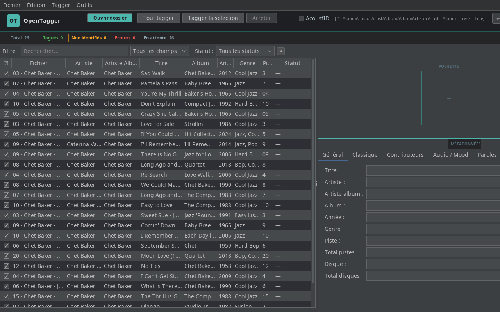

# OpenTagger

Tagger audio automatique open-source — alternative libre à Jaikoz.

Identifie et complète les métadonnées de vos fichiers MP3, FLAC, M4A, OGG via une chaîne de reconnaissance audio : **AcoustID → SongRec (Shazam)**, enrichie par **MusicBrainz**, **Discogs** et **Last.fm**.

Disponible en français et en anglais (Préférences → Démarrage → Langue).



---

## Fonctionnalités

### Identification audio

- **AcoustID** — empreinte audio (fpcalc) → MusicBrainz (MBID, artiste, album, piste, compilation)
- **SongRec** — client Shazam open-source, multi-offset (début / 1/3 / 2/3 du fichier), fallback si AcoustID échoue
- **Discogs + Last.fm** — enrichissement des genres après identification
- **BPM** — détection automatique via ffmpeg
- **Essentia** — clé musicale, mode, danceability (si installé)
- **Paroles** — téléchargement automatique
- **FanArt TV + Deezer** — pochettes haute résolution, plusieurs fournisseurs en cascade (Deezer sans clé API requise)

#### Niveaux de confiance des sources

| Source | Fiabilité | Ancre Album Completion |
|--------|-----------|------------------------|
| MBID (déjà tagué) | ★★★★★ 100 % | ✓ |
| AcoustID | ★★★★☆ 90 % | ✓ |
| SongRec (Shazam) | ★★★☆☆ 85 % | ✓ |
| Texte seul | ★★☆☆☆ ~60 % | ✗ |

### Organisation de la bibliothèque

- **Renommage par masques** — 5 masques prédéfinis :
  - `[iTunes Smart]` — compilations dans `Compilations/`, sinon `AlbumArtist/Album/Track`
  - `Standard` — `AlbumArtist/Album/Track - Title`
  - `[Lidarr/Plex]` — `AlbumArtist/Album (Année)/Track - Title` (natif Lidarr)
  - `Fichier seul` — renomme sans déplacer
  - `[Podcast]` — `Podcasts/Show/Season 02/S02E14 Titre`
- **Aperçu live** des 5 masques avant d'appliquer (**Ctrl+R** renomme les fichiers déjà tagués, **Ctrl+G** organise vers un dossier choisi explicitement)
- **Dossier racine bibliothèque** — tous les fichiers organisés vers un chemin configurable, activable/désactivable par case à cocher (Préférences → Renommage, ou menu **Tagger → Déplacement** pour un accès rapide sans ouvrir les Préférences)
- **Déplacement des fichiers non tagués / à durée incohérente** — vers des dossiers dédiés distincts de la bibliothèque organisée, chacun avec sa propre case à cocher ; rien n'est jamais supprimé
- **Grouper par compilations** — relie automatiquement les pistes déjà taguées appartenant à des séries de compilation connues (Stars 80, NRJ, Fun Radio, RFM…), liste configurable, dialogue de revue avant écriture
- **Compatibilité NAS / MergerFS** — copie+vérification de taille avant suppression de la source (pas d'`ATOMIC_MOVE` cross-device)

### Re-traitement (Outils → Re-traitement)

- **Forcer le re-taguage** — remet des fichiers déjà tagués en attente (cache + MBID effacés) pour les réidentifier ou leur réappliquer un script tagger mis à jour
- **Ré-identifier par empreinte audio (Non identifiés)** — façon "Identify and Fix Any Tags" de SongKong : reprend les fichiers "Non identifié" et tente de les retrouver par empreinte audio seule (SongRec puis AcoustID), sans tenir compte des tags ou du nom de fichier existants ; chaque résultat passe par une fenêtre de revue dédiée (accepter/rejeter) avant d'être conservé — rien n'est appliqué silencieusement. Déclenchable automatiquement après chaque taguage via une case dédiée (menu Tagger)
- **Nettoyer les noms (Non identifiés)** — corrige les noms de fichiers corrompus (préfixe numérique/catalogue, suffixe temporaire, marqueur de copie "(2)", identifiant long, segments dupliqués) pour les fichiers non identifiés, avec une variante enchaînant directement une ré-identification par empreinte
- **Marquer la sélection comme déjà taggée** — bascule manuellement des fichiers vers l'état Taggé sans passer par la chaîne d'identification

### Podcasts *(nouveau en v0.9.0, fix M4A en v0.9.1)*

Taguage et organisation automatique des fichiers podcast via flux RSS.

1. **Outils → Tagger comme podcast…**
2. Taper le nom du podcast → recherche iTunes (sans clé API) → sélection
3. Ou coller directement une URL RSS
4. Matching automatique fichier ↔ épisode **par durée audio** (ffprobe ± 5 s)
5. Dialog coloré : vert = matché, orange = non matché (à gérer manuellement)
6. Tags écrits : show, titre épisode, artiste, numéro, saison, date, URL flux RSS

Tags podcast écrits (compatibles iTunes / Plex / Jellyfin) :

| Champ | Tag ID3 | Tag MP4 |
|-------|---------|---------|
| URL flux RSS | `TXXX:PODCAST_URL` | `----:com.apple.iTunes:PODCAST_URL` |
| Saison | `TXXX:SEASON` | `----:com.apple.iTunes:SEASON` |
| Épisode | `TXXX:EPISODE` | `----:com.apple.iTunes:EPISODE` |
| Type | `TXXX:EPISODETYPE` | `----:com.apple.iTunes:EPISODETYPE` |
| Mots-clés | `TXXX:KEYWORDS` | `----:com.apple.iTunes:KEYWORDS` |

### Gestion des fichiers

- **Undo/Redo illimité** (Ctrl+Z / Ctrl+Y)
- **Détection de doublons** — 4 niveaux de confiance (MBID exact, AcoustID exact, empreinte brute exacte, heuristique titre+artiste). Sélection intelligente du meilleur fichier par qualité (FLAC > ALAC > M4A > OGG > MP3) puis taille.
- **Album Completion** — complète les fichiers SKIPPED d'un album en se basant sur les fichiers déjà identifiés par source fiable (pas SOURCE_TEXT)
- **Transcodage audio** (via ffmpeg) — convertit vers MP3/AAC/FLAC/Opus/etc. avec bitrate configurable, suppression optionnelle de la source (ne supprime qu'après confirmation que la conversion a réussi)
- **Récupération audio depuis des vidéos** — détecte les `.webm/.vob/.mpg/.mpeg/.avi/.mkv` au scan d'un dossier, tente de les identifier et de les convertir en MP3 tagué automatiquement ; reconnues → `Convertis/`, non reconnues → `Non identifié/` — rien n'est jamais supprimé
- **Scripts tagger** (JavaScript/Nashorn) — plusieurs scripts nommés, activables individuellement, avec une case globale pour tout couper d'un coup (Préférences → Script) ; transformations personnalisées sur les tags appliquées à chaque fichier juste avant l'écriture
- **Commande(s) après taguage** — une ou plusieurs commandes shell exécutées une fois en fin de run complet (ex. déclencher un scan Plex), configurables au même endroit que les scripts
- **Suppression des fichiers illisibles/corrompus**
- **Export CSV**, export/import historique JSON
- **Drag & drop** de dossiers et fichiers
- **Surveillance de dossier** (FolderWatcher) — rechargement automatique si fichiers ajoutés
- **Cache de scan incrémental** — au relancement, les fichiers inchangés depuis le dernier scan (même date de modification + taille) ne sont pas relus, seulement les nouveaux/modifiés

### Intégration système

- **Clic droit → Ouvrir avec OpenTagger** (Linux `.desktop` + Windows registre)
- **Dossiers de démarrage automatiques** configurables (ignorés si fichiers passés en argument)
- **Windows** — installeur graphique avec toutes les dépendances (voir [Installation](#installation)) ; configuration dans `%APPDATA%\OpenTagger\` ; SongRec non utilisé, l'identification par l'audio passe par AcoustID

### Interface

- Layout **table à gauche / détail à droite** avec pochette 140×140
- **3 modes d'affichage** (menu Affichage) — Liste à plat, Arborescence par album, ou Cover Flow (bêta)
- **Chips de statut cliquables** (Total / Tagués / Non identifiés / Erreurs / En attente) — cliquer filtre directement la table par statut, recliquer désactive ; recherche texte + sélecteur de champ juste à côté
- **Recherche dans les Préférences** — ~75 réglages répartis sur 9 onglets, un champ en haut du dialogue saute directement au bon onglet/champ sans avoir à deviner où il se trouve
- **Taille de la bibliothèque chargée** (Go/To) et nombre de fichiers dans la barre d'état, avec le détail par format et l'espace libre du disque en infobulle
- **Indicateur RAM en direct** (bas de fenêtre) — utile pour surveiller une session longue sur une grosse bibliothèque
- Thème dark FlatLaf, accent teal
- **Journal de correction** généré après chaque session
- **Confirmation avant de quitter** si une opération de fond (taguage, transcodage, complétion d'albums…) est encore en cours

### Contribution

- Soumission d'empreintes **AcoustID**
- Contribution à **MusicBrainz** via OAuth2 (tags, ratings, ajout à une collection)
- Correspondance manuelle avec recherche MusicBrainz
- **Synchronisation ListenBrainz** — récupère le nombre d'écoutes par piste et l'écrit en tag personnalisé (aucune clé API requise)

---

## Pipeline d'identification

```
Fichier audio chargé
        │
        ▼
  Tags existants ?
  MBID présent ? ──► SOURCE_MBID (score 100) ──► TAGGED ✓
        │ non
        ▼
  AcoustID (fpcalc)
        │ ──► MusicBrainz ──► SOURCE_ACOUSTID (score 85-95)
        │ échec
        ▼
  SongRec / Shazam (multi-offset)
        │ ──► titre+artiste ──► SOURCE_SONGREC (score 85)
        │ échec
        ▼
  SKIPPED ──► Album Completion (si album voisin identifié par source fiable)
```

---

## Installation

### Windows

Télécharger puis lancer l'installeur **`OpenTagger-x.y.z.exe`** (dépôt [opentagger-releases](https://github.com/pollomax847/opentagger-releases)). C'est un assistant graphique classique : aucun droit administrateur requis, rien à installer avant.

L'installeur apporte **toutes les dépendances** :

- **Java 21** embarqué (aucune installation de Java nécessaire)
- **ffmpeg** et **ffprobe** (BPM, transcodage, écriture M4A)
- **AtomicParsley** (écriture des tags M4A)
- **fpcalc** (Chromaprint, empreintes AcoustID)

Il ajoute un raccourci dans le menu Démarrer (groupe « OpenTagger ») et sur le bureau, et se désinstalle depuis **Paramètres → Applications**. La configuration reste dans `%APPDATA%\OpenTagger\` et survit aux mises à jour comme à la désinstallation.

> L'installeur n'est pas signé : au premier lancement, Windows SmartScreen peut afficher « Éditeur inconnu » — cliquer sur **Informations complémentaires → Exécuter quand même**.

**Au premier démarrage**, une fenêtre propose de saisir les clés API (AcoustID, Discogs, Last.fm, FanArt.tv), avec un lien pour obtenir chacune et un bouton « Tester ». Tout est facultatif et modifiable ensuite dans **Préférences → APIs**.

**Limites sous Windows :**

- **SongRec (Shazam) n'est pas utilisé** : il n'est pas utilisable depuis OpenTagger sous Windows. L'identification par l'audio repose sur **AcoustID** — une clé AcoustID est donc nécessaire pour identifier autre chose que par le nom ou les tags. Les extraits très courts (aperçus de ~30 s) ne sont en général pas reconnus par AcoustID.
- L'entrée de clic droit « Ouvrir avec OpenTagger » n'est pas ajoutée par l'installeur.

**Générer l'installeur depuis les sources** (JDK 21 et [WiX Toolset 3](https://github.com/wixtoolset/wix3/releases) dans le PATH) :

```bat
cd opentagger
mvn package -DskipTests
:: placer opentagger.jar dans un dossier "in", et ffmpeg.exe, ffprobe.exe (+ leurs DLL, build "shared"),
:: AtomicParsley.exe et fpcalc.exe dans un dossier "tools"
jpackage --type exe --name OpenTagger --app-version 0.9.31 --input in --main-jar opentagger.jar ^
  --icon logo.ico --app-content tools\ffmpeg.exe,tools\ffprobe.exe,tools\AtomicParsley.exe,tools\fpcalc.exe,tools\avcodec-63.dll,... ^
  --win-menu --win-menu-group OpenTagger --win-shortcut --win-dir-chooser --win-per-user-install --dest dist
```

`--app-content` dépose les fichiers à côté de `OpenTagger.exe`, où Windows les trouve par leur simple nom, sans toucher au PATH. Le jeu de DLL de ffmpeg dépend du build utilisé : toutes les lister.

### Prérequis (Linux, lancement manuel, compilation)

- **Java 21+**
- **ffmpeg** (BPM, extraction segment audio pour SongRec, transcodage audio)
- **AtomicParsley** (écriture des tags M4A)
- **fpcalc** (Chromaprint) — téléchargeable via **Préférences → Audio** si absent
- **SongRec** (optionnel, Linux/macOS) — pas dans les dépôts officiels Debian/Ubuntu, nécessite d'ajouter la PPA tierce avant `apt install` :
  ```bash
  sudo add-apt-repository ppa:marin-m/songrec
  sudo apt update && sudo apt install songrec
  ```
  ou compilation depuis [github.com/marin-m/SongRec](https://github.com/marin-m/SongRec)

### Linux

**Debian / Ubuntu** — dépôt apt signé, dépendances (ffmpeg, JRE) résolues automatiquement :

```bash
curl -fsSL https://pollomax847.github.io/opentagger-releases/apt/opentagger-apt.asc \
    | sudo tee /usr/share/keyrings/opentagger.asc >/dev/null
echo "deb [signed-by=/usr/share/keyrings/opentagger.asc] https://pollomax847.github.io/opentagger-releases/apt ./" \
    | sudo tee /etc/apt/sources.list.d/opentagger.list
sudo apt update && sudo apt install opentagger
```

**Autres distributions / depuis les sources :**

```bash
git clone https://github.com/pollomax847/opentagger
cd opentagger
bash install-opentagger.sh
```

Installe le `.desktop` (avec intégration clic-droit "Ouvrir avec"), l'icône et un lanceur autonome dans `~/.local/bin/opentagger` — le `.jar` est copié dans `~/.local/share/opentagger/`, indépendant du dépôt cloné.

### Lancement manuel

```bash
java -jar opentagger/target/opentagger.jar
# ou avec un fichier/dossier en argument (clic droit)
java -jar opentagger.jar /chemin/vers/musique
```

### Compiler depuis les sources

```bash
cd opentagger
mvn package -DskipTests
# JAR produit : target/opentagger.jar
```

---

## Mises à jour

OpenTagger vérifie automatiquement (une fois par jour) s'il existe une version plus récente, et
propose de la télécharger et de l'installer directement depuis l'application — pas besoin de
recloner ou recompiler. Vérification manuelle possible à tout moment via **Outils → Vérifier les
mises à jour…**, et désactivable dans **Préférences → Démarrage**.

Les binaires publiés sont hébergés sur un dépôt séparé, [opentagger-releases](https://github.com/pollomax847/opentagger-releases) — ce dépôt-ci contient uniquement le code source.

---

## Configuration

Au premier lancement, une fenêtre propose de saisir les clés API (facultatives). Elles restent modifiables à tout moment dans **Préférences** (Ctrl+,) :

| Onglet | Paramètre | Obtenir la clé |
|--------|-----------|----------------|
| APIs | Clé AcoustID | [acoustid.org/login](https://acoustid.org/login) |
| APIs | Clé Discogs | [discogs.com/settings/developers](https://www.discogs.com/settings/developers) |
| APIs | Clé Last.fm | [last.fm/api](https://www.last.fm/api/account/create) |
| APIs | Clé FanArt TV | [fanart.tv/get-an-api-key](https://fanart.tv/get-an-api-key/) |
| APIs | Nom d'utilisateur ListenBrainz | Aucune clé requise — juste votre pseudo public |
| Audio | Chemin fpcalc | Ou cliquer **Télécharger fpcalc** (déjà inclus par l'installeur Windows) |
| Renommage | Dossier racine bibliothèque | Ex. `/nas/Musique` |
| Renommage | Dossier racine podcasts | Ex. `/nas/Podcasts` |

---

## Utilisation rapide

### Musique

1. **Ouvrir un dossier** (Ctrl+O ou drag & drop)
2. Cocher **AcoustID** si les fichiers sont peu tagués
3. **Tout tagger** (F6) ou **Tagger la sélection** (F7), puis **Enregistrer tout** (F8)
4. Filtre **Non identifiés** → **Tagger → Compléter les albums…** (Ctrl+L) pour compléter à partir des pistes déjà identifiées du même album
5. **Ctrl+R** (renommer les fichiers tagués) ou **Ctrl+G** (organiser vers un dossier choisi, avec aperçu)

### Podcasts

1. Télécharger les épisodes dans un dossier
2. **Ouvrir ce dossier** dans OpenTagger
3. **Outils → Tagger comme podcast…**
4. Taper le nom ou coller l'URL RSS → sélectionner le podcast
5. Vérifier le tableau de matching (vert / orange) → **Tagger**

### Doublons

1. Charger la bibliothèque
2. **Outils → Détecter les doublons…**
3. Cliquer **Sélection intelligente** → les fichiers de moindre qualité sont cochés automatiquement
4. **Déplacer dans la corbeille**

---

## Technologies

| Composant | Technologie |
|-----------|-------------|
| Langage | Java 21 |
| Build | Maven + Shade plugin (fat JAR) |
| UI | Swing + FlatLaf 3.4 (thème dark) |
| Tags audio | JAudioTagger 3.0.1 + AtomicParsley + ffmpeg |
| JSON | Jackson |
| Cache | SQLite (Xerial) |
| Identification | AcoustID, SongRec (Shazam) |
| Métadonnées | MusicBrainz, Discogs, Last.fm, FanArt TV, Deezer |
| Podcasts | iTunes Search API + RSS (javax.xml) |

---

## Licence

MIT — libre d'utilisation, de modification et de distribution.
